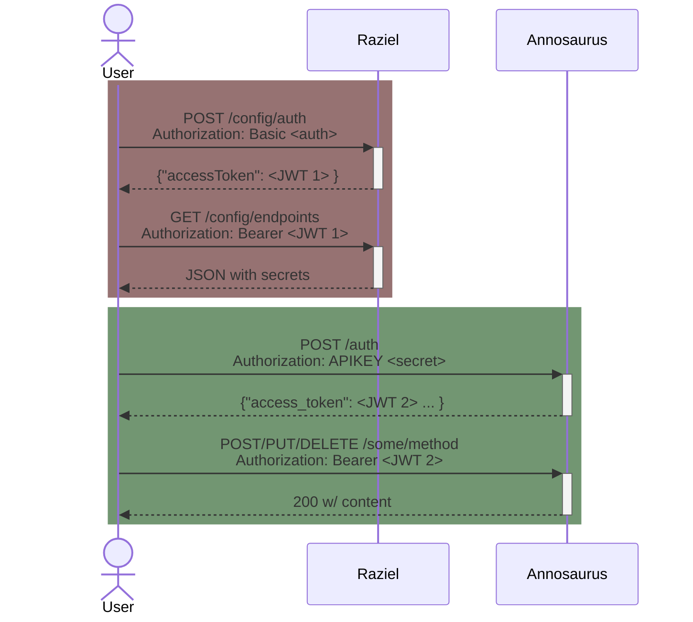

# raziel


Raziel is a configuration server, the keeper of secrets. It provides centralized configuration management and authentication for M3/VARS (Video Annotation and Reference System) microservices.

## Key Features

- **Centralized Authentication**: Issues JWT tokens for secure access to VARS microservices
- **Secret Management**: Stores and distributes encrypted API keys and credentials using Jasypt encryption
- **Service Discovery**: Provides endpoint configuration for all VARS services (Annosaurus, Vampire-Squid, Panoptes, etc.)
- **Health Monitoring**: Aggregates health status from all configured microservices
- **API Documentation**: Built-in Swagger UI for interactive API exploration
- **Flexible Configuration**: Environment-based configuration with sensible defaults

## Authentication Flow

The flow of a security handshake is:



## Quick Start

### Running with Docker

The easiest way to run Raziel is using Docker:

```bash
docker pull mbari/raziel:latest

docker run -d \
  -p 8080:8080 \
  -e RAZIEL_MASTER_KEY="your-secure-master-key" \
  -e RAZIEL_JWT_SIGNING_SECRET="your-jwt-secret" \
  -e ANNOSAURUS_URL="http://annosaurus:8082/anno/v1" \
  -e ANNOSAURUS_SECRET="encrypted-secret" \
  -e VARS_USER_SERVER_URL="http://oni:8080/oni/v1" \
  -e VARS_USER_SERVER_SECRET="encrypted-secret" \
  --name raziel \
  mbari/raziel:latest
```

### Building the Docker Image

```bash
# Standard build (linux/amd64)
sbt "Docker / publish"

# Multi-arch build (linux/amd64 and linux/arm64)
./build.sh
```

The build script automatically detects Apple Silicon (ARM64) and uses `docker buildx` for multi-platform images.

## Configuration

Raziel requires configuration for each VARS service you want to manage. Configuration is done via environment variables.

### Required Environment Variables

```bash
# Security (MUST set in production)
RAZIEL_MASTER_KEY=<encryption-key-for-secrets>
RAZIEL_JWT_SIGNING_SECRET=<jwt-signing-key>

# At minimum, you need a user service (Oni or vars-user-server)
VARS_USER_SERVER_URL=<url>
VARS_USER_SERVER_SECRET=<secret>
```

### Optional Service Configurations

Each VARS service can be configured with the following environment variables (replace `<SERVICE>` with service name):

```bash
# Service URLs
ANNOSAURUS_URL=<url>
BEHOLDER_URL=<url>
CHARYBDIS_URL=<url>
ONI_URL=<url>
PANOPTES_URL=<url>
SKIMMER_URL=<url>
VAMPIRE_SQUID_URL=<url>
VARS_KB_SERVER_URL=<url>

# Internal URLs (for health checks, defaults to public URL)
ANNOSAURUS_INTERNAL_URL=<url>
# ... etc for each service

# Secrets (for services requiring authentication)
ANNOSAURUS_SECRET=<encrypted-secret>
BEHOLDER_SECRET=<encrypted-secret>
ONI_SECRET=<encrypted-secret>
PANOPTES_SECRET=<encrypted-secret>
VAMPIRE_SQUID_SECRET=<encrypted-secret>
VARS_USER_SERVER_SECRET=<encrypted-secret>

# Timeouts (optional, defaults to 10 seconds)
ANNOSAURUS_TIMEOUT="10 seconds"
# ... etc for each service
```

### Additional Configuration

```bash
# HTTP Server
RAZIEL_HTTP_PORT=8080
RAZIEL_HTTP_CONTEXT="/"

# JWT Settings
RAZIEL_JWT_EXPIRATION="180 days"
RAZIEL_JWT_ISSUER="http://www.mbari.org"
```

### Service Priority

**Note**: If `ONI_URL` is configured, Oni will be used for both user authentication and knowledgebase access, replacing `vars-user-server` and `vars-kb-server`.

## API Endpoints

Once running, Raziel exposes:

- `POST /config/auth` - Authenticate and receive JWT token
- `GET /config/endpoints` - Get service configurations (requires JWT)
- `GET /health` - Health status of all services
- `GET /docs` - Swagger UI documentation

Access Swagger UI at: `http://localhost:8080/docs`

## Development

### Requirements

- Java 21 (Temurin recommended)
- sbt 1.x

### Running Locally

```bash
# Compile
sbt compile

# Run tests
sbt test

# Run application
sbt run

# Run on custom port
sbt "run --port 9000"
```

## Documentation

Documentation is at <https://mbari-org.github.io/raziel/>

### Building Documentation

Documentation can be added as markdown files in `src/docs/` and will be included when you run:

```bash
sbt doc  # Generates Scaladoc with embedded markdown documentation
```

## License

Apache License 2.0 - see LICENSE file for details.

Copyright 2021 Monterey Bay Aquarium Research Institute
