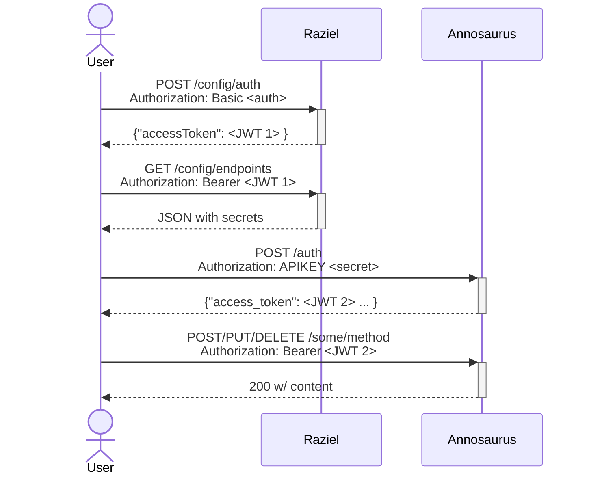

# raziel

Raziel is a configuration server, the keeper of secrets. It can be used to lookup the configuration of a M3/VARS installation.

The flow of a security handshake is:

## Documentation

Documentation is at <https://mbari-org.github.io/raziel/>

## Notes

Documentation can be added as markdown files in `docs` and will be included automatically when you run `laikaSite`.
