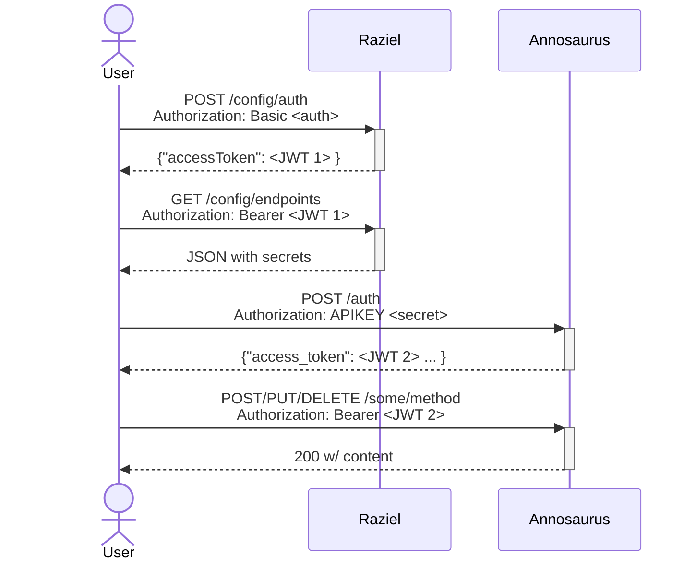

# raziel

Raziel is a configuration server for the Video Annotation and Reference System (VARS). It provides health checks for all the VARS services as well as access to security keys for the individual services.

## Overview

Raziel provides a security handshake with the following flow:

## Documentation

Documentation is at <https://mbari-org.github.io/raziel/>